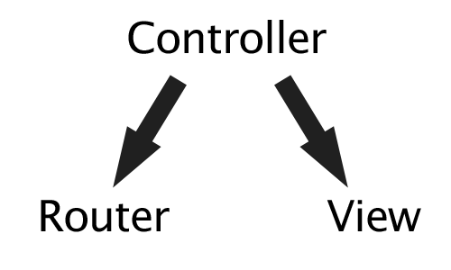

!SLIDE center

!SLIDE small bullets incremental

# What is Backbone?

* Client-side MV* Framework
* Created by Jeremy Ashkenas

!SLIDE

# Backbone Models

!SLIDE small code fixed-top

    @@@ javascript

    var Todo = Backbone.Model.extend({

      // Default attributes for the todo item.
      defaults: function() {
        return {
          title: "empty todo...",
          done: false
        };
      },

      // Toggle the `done` state of this todo item.
      toggle: function() {
        this.save({done: !this.get("done")});
      }

    });

!SLIDE smaller code

    @@@ javascript

    var todo = new Todo({ title: "Deliver presentation" })
    togo.get('title') // => "Deliver presentation"

!SLIDE

# Backbone Collections

!SLIDE small code fixed-top

    @@@ javascript

    var TodoCollection = Backbone.Collection.extend({

      // Reference to this collection's model.
      model: Todo,

      // Filter down the list of all
      // todo items that are finished.
      done: function() {
        return this.filter(function(todo){ 
          return todo.get('done'); 
        });
      }

    });

    var todos = new TodoCollection()
    todos.fetch()

!SLIDE

# Backbone Controllers

!SLIDE bullets fixed-top

# Backbone Controllers

* 

!SLIDE bullets fixed-top

# Backbone Controllers

* 

!SLIDE

# Backbone Routers

!SLIDE small

    @@@ javascript

    var AppRouter = Backbone.Router.extend({
      routes: {
        '':     'showTodos',
        'help': 'showHelp'
      },
      showTodos: function() {
        new TodosView();
      },
      showHelp: function() {
        new HelpView();
      }
    })

!SLIDE

# Backbone Views

!SLIDE smaller fixed-top

## Backbone Views - templating

    @@@ javascript

    var TodoView = Backbone.View.extend({

      render: function() {
        var source   = $('#mainViewTemplate').html()
        var template = _.template(source);
        var data     = this.model.toJSON()
        var html     = template(data);
        this.$el.html(html);
        return this;
      }

    })

    var todo = new Todo();
    todo.set('title', 'MOAR COFFEE');

    var todoView = new TodoView({ model: todo });

!SLIDE smaller fixed-top

## Backbone Views - events

    @@@ javascript

    var TodoView = Backbone.View.extend({

        // ...

        events: {
          "click .toggle"   : "toggleDone",
        },

        // Toggle the `"done"` state of the model.
        toggleDone: function() {
          this.model.toggle();
        }

    });

!SLIDE smaller fixed-top

## Backbone Views - binding

    @@@ javascript

    var TodoView = Backbone.View.extend({

      initialize: function() {
        this.model.bind('change', this.render, this);
      }

    })

!SLIDE smaller fixed-top

## Backbone Views - templating again

    @@@ javascript

    var TodoView = Backbone.View.extend({

      render: function() {
        var source   = $('#mainViewTemplate').html()
        var template = _.template(source);
        var data     = this.model.toJSON()
        var html     = template(data);
        this.$el.html(html);
        return this;
      }

    })

