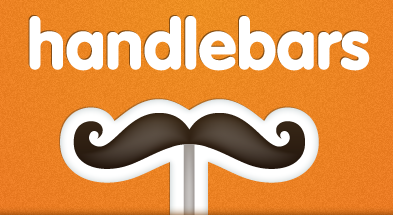

!SLIDE center

!SLIDE small bullets incremental

# Why Handlebars?

* Templates are clean
* Helpers store the logic
* Precompilation with a light runtime

!SLIDE smaller fixed-top

# todos.handlebars

    @@@ html

    

      <input class="toggle" type="checkbox" {{checkedIf done}}>
      <label>{{title}}</label>
      
    

    <input class="edit" type="text" value="{{title}}" />

!SLIDE smaller fixed-top

# todos.handlebars

    @@@ html

    

      <input class="toggle" type="checkbox" checked="checked">
      <label>KILL ALL HUMANS</label>
      
    

    <input class="edit" type="text" value="KILL ALL HUMANS" />

!SLIDE code center

## handlebars dir -f output.js

!SLIDE code center

    @@@ javascript
    Handlebars.templates['todos']

!SLIDE smaller fixed-top

# Applied

    @@@ javascript

    var TodoView = Backbone.View.extend({
      template: 'todos',

      render: function() {
        var template = Handlebars.templates[this.template]
        var data     = this.model.toJSON()
        var html     = template(data);
        this.$el.html(html);
        return this;
      }

    });

!SLIDE smaller fixed-top

# OMG Pattern

    @@@ javascript

    var HandlebarsView = Backbone.View.extend({

      render: function() {
        var template = Handlebars.templates[this.template]
        var data     = this.model.toJSON()
        var html     = template(data);
        this.$el.html(html);
        return this;
      }

    });

!SLIDE smaller fixed-top

# Profit!

    @@@ javascript

    var TodoView = HandlebarsView.extend({
      template: 'todos'
    });
   